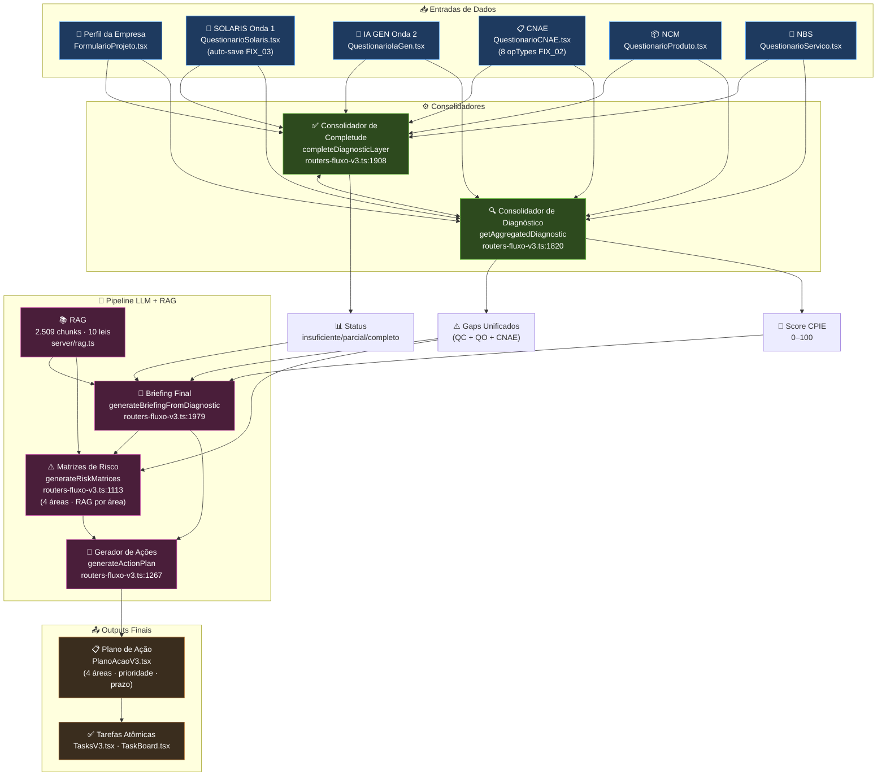

# Fluxo E2E — Rastreabilidade Completa
**HEAD:** `f8a5864` · **Data:** 2026-04-09 · **Fonte da verdade:** [GitHub main](https://github.com/Solaris-Empresa/compliance-tributaria-v2/blob/f8a58640c04a6774fe3672e8cc8b48f92482820f/)

> Documento gerado por auditoria automática do código-fonte. Cada componente tem referência exata de arquivo, linha e URL GitHub.

---

## Diagrama do Fluxo E2E (atualizado)

> **Diferenças em relação ao diagrama original (31/03):**
> - SOLARIS agora tem **auto-save debounce 800ms** (FIX_03) e **resume da última pergunta**
> - CNAE agora tem **8 operationTypes** no opLabel (FIX_02 — era 3)
> - **Gate obrigatório** no Briefing: todas as 3 camadas + Onda 1 concluída (BUG-BRIEFING-01)
> - **RAG por área** nas matrizes de risco (4 queries específicas por domínio)
> - **Score CPIE** é output explícito do Consolidador de Diagnóstico

---

## Tabela de Rastreabilidade E2E

| Componente | Arquivo | Linha | GitHub | Objetivo |
|-----------|---------|-------|--------|----------|
| 📥 Perfil da Empresa | `client/src/pages/FormularioProjeto.tsx` | L2 | [→ GitHub](https://github.com/Solaris-Empresa/compliance-tributaria-v2/blob/f8a58640c04a6774fe3672e8cc8b48f92482820f/client/src/pages/FormularioProjeto.tsx#L2) | Cadastro inicial da empresa: razão social, CNPJ, operationType (produto/serviço/misto/comercio/industria/agronegocio/financeiro), regime tributário e porte. |
| 📥 SOLARIS (Onda 1) | `client/src/pages/QuestionarioSolaris.tsx` | L2 | [→ GitHub](https://github.com/Solaris-Empresa/compliance-tributaria-v2/blob/f8a58640c04a6774fe3672e8cc8b48f92482820f/client/src/pages/QuestionarioSolaris.tsx#L2) | Questionário estratégico de 20 perguntas sobre o negócio. Auto-save debounce 800ms (FIX_03). Resume da última pergunta respondida. |
| 📥 IA GEN (Onda 2) | `client/src/pages/QuestionarioIaGen.tsx` | L2 | [→ GitHub](https://github.com/Solaris-Empresa/compliance-tributaria-v2/blob/f8a58640c04a6774fe3672e8cc8b48f92482820f/client/src/pages/QuestionarioIaGen.tsx#L2) | Questionário gerado por IA com base nas respostas da Onda 1 SOLARIS. Perguntas adaptativas por perfil de empresa. |
| 📥 CNAE | `client/src/pages/QuestionarioCNAE.tsx` | L2 | [→ GitHub](https://github.com/Solaris-Empresa/compliance-tributaria-v2/blob/f8a58640c04a6774fe3672e8cc8b48f92482820f/client/src/pages/QuestionarioCNAE.tsx#L2) | Identificação e confirmação dos CNAEs da empresa. Embedding semântico com opLabel de 8 operationTypes (FIX_02). |
| 📥 NCM | `client/src/pages/QuestionarioProduto.tsx` | L2 | [→ GitHub](https://github.com/Solaris-Empresa/compliance-tributaria-v2/blob/f8a58640c04a6774fe3672e8cc8b48f92482820f/client/src/pages/QuestionarioProduto.tsx#L2) | Classificação fiscal de produtos (NCM). Alimenta o diagnóstico de incidência CBS/IBS sobre mercadorias. |
| 📥 NBS | `client/src/pages/QuestionarioServico.tsx` | L2 | [→ GitHub](https://github.com/Solaris-Empresa/compliance-tributaria-v2/blob/f8a58640c04a6774fe3672e8cc8b48f92482820f/client/src/pages/QuestionarioServico.tsx#L2) | Classificação fiscal de serviços (NBS). Alimenta o diagnóstico de incidência CBS/IBS sobre serviços. |
| ⚙️ Consolidador de Completude | `server/routers-fluxo-v3.ts` | L1908 | [→ GitHub](https://github.com/Solaris-Empresa/compliance-tributaria-v2/blob/f8a58640c04a6774fe3672e8cc8b48f92482820f/server/routers-fluxo-v3.ts#L1908) | Verifica se todas as 3 camadas do diagnóstico estão completas (QC, QO, CNAE). Retorna status: insuficiente / parcial / completo. |
| ⚙️ Consolidador de Diagnóstico | `server/routers-fluxo-v3.ts` | L1820 | [→ GitHub](https://github.com/Solaris-Empresa/compliance-tributaria-v2/blob/f8a58640c04a6774fe3672e8cc8b48f92482820f/server/routers-fluxo-v3.ts#L1820) | Agrega dados de todas as entradas (SOLARIS, IA GEN, CNAE, NCM, NBS, Perfil) e calcula gaps, score CPIE e status por camada. |
| 📤 Status de Completude | `server/routers-fluxo-v3.ts` | L2220 | [→ GitHub](https://github.com/Solaris-Empresa/compliance-tributaria-v2/blob/f8a58640c04a6774fe3672e8cc8b48f92482820f/server/routers-fluxo-v3.ts#L2220) | Retorna insuficiente / parcial / completo por camada. Gate obrigatório antes de gerar briefing. |
| 📤 Gaps Unificados | `server/routers-fluxo-v3.ts` | L1820 | [→ GitHub](https://github.com/Solaris-Empresa/compliance-tributaria-v2/blob/f8a58640c04a6774fe3672e8cc8b48f92482820f/server/routers-fluxo-v3.ts#L1820) | Lista de gaps tributários identificados por camada (QC, QO, CNAE). Base para o briefing e a matriz de riscos. |
| 📤 Riscos | `server/routers-fluxo-v3.ts` | L1113 | [→ GitHub](https://github.com/Solaris-Empresa/compliance-tributaria-v2/blob/f8a58640c04a6774fe3672e8cc8b48f92482820f/server/routers-fluxo-v3.ts#L1113) | 4 matrizes de risco (Contabilidade, Negócio, TI, Jurídico) geradas por LLM com RAG específico por área. Armazenadas em project_risks_v3. |
| 📤 Score CPIE | `server/routers-fluxo-v3.ts` | L1820 | [→ GitHub](https://github.com/Solaris-Empresa/compliance-tributaria-v2/blob/f8a58640c04a6774fe3672e8cc8b48f92482820f/server/routers-fluxo-v3.ts#L1820) | Score de compliance 0–100 calculado a partir dos gaps e completude do diagnóstico. |
| 🤖 Briefing Final | `server/routers-fluxo-v3.ts` | L1979 | [→ GitHub](https://github.com/Solaris-Empresa/compliance-tributaria-v2/blob/f8a58640c04a6774fe3672e8cc8b48f92482820f/server/routers-fluxo-v3.ts#L1979) | Gerado por LLM com RAG. Consolida perfil + SOLARIS + IA GEN + CNAE + gaps. Gate: todas as 3 camadas completas + Onda 1 concluída (BUG-BRIEFING-01 corrigido). |
| 🤖 Gerador de Ações | `server/routers-fluxo-v3.ts` | L1267 | [→ GitHub](https://github.com/Solaris-Empresa/compliance-tributaria-v2/blob/f8a58640c04a6774fe3672e8cc8b48f92482820f/server/routers-fluxo-v3.ts#L1267) | Gera plano de ação por área a partir das matrizes de risco + briefing. Enriquecido com respostas do questionário (V70.2). |
| 📤 Plano de Ação | `client/src/pages/PlanoAcaoV3.tsx` | L638 | [→ GitHub](https://github.com/Solaris-Empresa/compliance-tributaria-v2/blob/f8a58640c04a6774fe3672e8cc8b48f92482820f/client/src/pages/PlanoAcaoV3.tsx#L638) | Plano estruturado por área (Contabilidade, Negócio, TI, Jurídico) com prioridade, prazo e responsável. |
| 📤 Tarefas Atômicas | `client/src/pages/compliance-v3/TasksV3.tsx` | L20 | [→ GitHub](https://github.com/Solaris-Empresa/compliance-tributaria-v2/blob/f8a58640c04a6774fe3672e8cc8b48f92482820f/client/src/pages/compliance-v3/TasksV3.tsx#L20) | Tarefas granulares derivadas do plano de ação. Gerenciadas em quadro Kanban (TaskBoard.tsx). |
| 🏗️ RAG (2.509 chunks) | `server/rag.ts` | Lgrep | [→ GitHub](https://github.com/Solaris-Empresa/compliance-tributaria-v2/blob/f8a58640c04a6774fe3672e8cc8b48f92482820f/server/rag.ts#Lgrep) | Retrieval-Augmented Generation: 2.509 chunks de 10 leis da Reforma Tributária. Usado em generateBriefingFromDiagnostic e generateRiskMatrices. |
| 🏗️ CNAE Embeddings | `server/cnae-embeddings.ts` | L251 | [→ GitHub](https://github.com/Solaris-Empresa/compliance-tributaria-v2/blob/f8a58640c04a6774fe3672e8cc8b48f92482820f/server/cnae-embeddings.ts#L251) | Engine de embeddings semânticos para identificação automática de CNAEs. opLabel com 8 operationTypes (FIX_02 — BUG-CNAE-AUTO). |
| 🏗️ Risk Engine | `server/riskEngine.ts` | L— | [→ GitHub](https://github.com/Solaris-Empresa/compliance-tributaria-v2/blob/f8a58640c04a6774fe3672e8cc8b48f92482820f/server/riskEngine.ts) | Engine matemático de cálculo de risco (probability × impact = risk_score). Tipos: RiskItem, RiskSummary, GapInput. |
| 🏗️ Schema DB (TiDB Cloud) | `drizzle/schema.ts` | L1768 | [→ GitHub](https://github.com/Solaris-Empresa/compliance-tributaria-v2/blob/f8a58640c04a6774fe3672e8cc8b48f92482820f/drizzle/schema.ts#L1768) | Banco TiDB Cloud. Tabelas principais: projects, solaris_answers, project_risks_v3, rag_chunks, rag_documents, questionnaire_answers_v3. |

---

## Infraestrutura de Suporte

| Componente | Arquivo | Linha | GitHub | Objetivo |
|-----------|---------|-------|--------|----------|
| 🏗️ RAG Engine | `server/rag.ts` | — | [https://github.com/Solaris-Empresa/compliance-tributaria-v2/blob/f8a58640c04a6774fe3672e8cc8b48f92482820f/server/rag.ts](https://github.com/Solaris-Empresa/compliance-tributaria-v2/blob/f8a58640c04a6774fe3672e8cc8b48f92482820f/server/rag.ts) | 2.509 chunks · 10 leis da Reforma Tributária |
| 🏗️ CNAE Embeddings | `server/cnae-embeddings.ts` | — | [https://github.com/Solaris-Empresa/compliance-tributaria-v2/blob/f8a58640c04a6774fe3672e8cc8b48f92482820f/server/cnae-embeddings.ts](https://github.com/Solaris-Empresa/compliance-tributaria-v2/blob/f8a58640c04a6774fe3672e8cc8b48f92482820f/server/cnae-embeddings.ts) | Embedding semântico · 8 operationTypes (FIX_02) |
| 🏗️ Risk Engine | `server/riskEngine.ts` | — | [https://github.com/Solaris-Empresa/compliance-tributaria-v2/blob/f8a58640c04a6774fe3672e8cc8b48f92482820f/server/riskEngine.ts](https://github.com/Solaris-Empresa/compliance-tributaria-v2/blob/f8a58640c04a6774fe3672e8cc8b48f92482820f/server/riskEngine.ts) | Cálculo matemático probability × impact |
| 🏗️ Schema DB | `drizzle/schema.ts` | — | [https://github.com/Solaris-Empresa/compliance-tributaria-v2/blob/f8a58640c04a6774fe3672e8cc8b48f92482820f/drizzle/schema.ts](https://github.com/Solaris-Empresa/compliance-tributaria-v2/blob/f8a58640c04a6774fe3672e8cc8b48f92482820f/drizzle/schema.ts) | TiDB Cloud · tabelas principais do sistema |

---

## Procedures tRPC — Mapa Completo (routers-fluxo-v3.ts)

| Procedure | Linha | Tipo | Papel no Fluxo E2E |
|-----------|-------|------|-------------------|
| `createProject` | L67 | mutation | Cria projeto e perfil da empresa |
| `extractCnaes` | L147 | mutation | Extrai CNAEs via embedding semântico |
| `refineCnaes` | L333 | mutation | Refina CNAEs com LLM |
| `confirmCnaes` | L434 | mutation | Confirma CNAEs selecionados |
| `getOnda1Questions` | L2307 | query | Carrega perguntas SOLARIS + respostas salvas |
| `saveSolarisAnswer` | L2433 | mutation | Auto-save individual SOLARIS (FIX_03) |
| `completeOnda1` | L2345 | mutation | Finaliza Onda 1 SOLARIS |
| `generateOnda2Questions` | L2461 | mutation | Gera perguntas IA GEN com base na Onda 1 |
| `completeOnda2` | L2582 | mutation | Finaliza Onda 2 IA GEN |
| `getProductQuestions` | L2718 | query | Carrega perguntas NCM (produtos) |
| `completeProductQuestionnaire` | L2802 | mutation | Finaliza questionário NCM |
| `getServiceQuestions` | L2761 | query | Carrega perguntas NBS (serviços) |
| `completeServiceQuestionnaire` | L2841 | mutation | Finaliza questionário NBS |
| `completeDiagnosticLayer` | L1908 | mutation | **Consolidador de Completude** — gate por camada |
| `getAggregatedDiagnostic` | L1820 | query | **Consolidador de Diagnóstico** — gaps + score CPIE |
| `getDiagnosticStatus` | L2220 | query | Status insuficiente/parcial/completo |
| `generateBriefingFromDiagnostic` | L1979 | mutation | **Briefing Final** — LLM + RAG + gate 3 camadas |
| `generateRiskMatrices` | L1113 | mutation | **Matrizes de Risco** — 4 áreas · RAG por área |
| `approveMatrices` | L1242 | mutation | Aprovação das matrizes pelo consultor |
| `generateActionPlan` | L1267 | mutation | **Gerador de Ações** — plano por área |
| `approveActionPlan` | L1554 | mutation | Aprovação do plano de ação |
| `updateTask` | L1441 | mutation | Atualiza tarefa atômica (status, responsável) |

---

## Fixes Aplicados nesta Sessão (Gate B ✅)

| Fix | Bug | Componente afetado | Arquivo | PR |
|-----|-----|-------------------|---------|-----|
| FIX_01 | Gate EVIDENCE | PR template + FF-EVIDENCE-01/02 | `.github/pull_request_template.md` · `server/integration/fitness-functions.test.ts` | [#414](https://github.com/Solaris-Empresa/compliance-tributaria-v2/pull/414) |
| FIX_02 | BUG-CNAE-AUTO | CNAE Embeddings — opLabel 8 valores | `server/cnae-embeddings.ts:228` | [#414](https://github.com/Solaris-Empresa/compliance-tributaria-v2/pull/414) |
| FIX_03 | BUG-SOLARIS-SAVE | SOLARIS auto-save + resume | `server/routers-fluxo-v3.ts:2433` · `client/src/pages/QuestionarioSolaris.tsx` | [#414](https://github.com/Solaris-Empresa/compliance-tributaria-v2/pull/414) |

---

*Gerado automaticamente — não editar manualmente.*
*Próxima atualização: Sprint Z-07 (Sistema de Riscos v4)*
