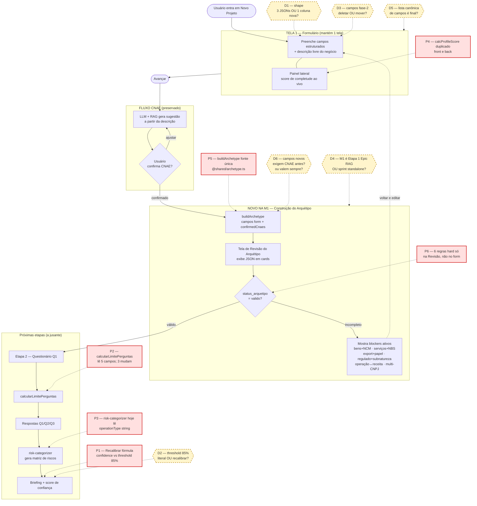

# M1 — Arquétipo de Negócio · Documento de Exploração

> Documento vivo · iniciado 2026-04-23 · mantido pelo Orquestrador + Claude Code
> **Status:** F0 — **validação de hipótese** (suspenso pré-spec até testes validarem o arquétipo)

Este documento consolida o trabalho exploratório antes da abertura formal da spec M1. Não substitui a SPEC (F1) nem o ADR; é o lugar onde acumulamos o entendimento do escopo, dependências, decisões em aberto e riscos antes de congelar um plano de implementação.

> ⛔ **PARADA DE PRODUÇÃO (2026-04-23):** P.O. declarou que **não avançaremos para implementação até testes com casos reais comprovarem que o arquétipo é a abstração correta** para orientar o RAG. O arquétipo é uma hipótese do P.O. — pode estar errada. Ver Seção 11.

---

## 1. Escopo declarado pelo P.O.

Grande output da M1: **arquétipo de negócio consistente e auditável, derivado do formulário de projeto após a confirmação do CNAE.**

### Restrições operacionais (travadas pelo P.O. em 2026-04-23)

| # | Restrição | Consequência |
|---|---|---|
| 1 | **Sem migração de dados.** Único dado preservado é o RAG. Projetos e tabelas satélites podem ser limpos (`db:reset`). | Elimina dual-read / snapshot / feature flag de paralelismo |
| 2 | **Sem mudança de fluxo nem de estrutura.** Apenas inserir campos novos e excluir campos obsoletos. | Não é wizard de 8 telas — mantém formulário em 1 tela |
| 3 | **CNAE free-text mantido.** Usuário digita descrição; sistema gera CNAE via LLM+RAG no avanço do form. | Elimina necessidade de autocomplete controlado para CNAE |
| 4 | **Tela de revisão do arquétipo no final do form.** Gate de avanço: só libera próxima etapa se arquétipo válido. | Único componente novo (`RevisaoArquetipo.tsx`) |
| 5 | **Arquétipo só fica completo após confirmação do CNAE.** | A tela de revisão vive **depois** da confirmação — antes não há arquétipo |

---

## 2. Inventário AS-IS (estado atual da base)

### 2.1 UX — Formulário atual

- **Rota principal:** `client/src/pages/NovoProjeto.tsx` (Etapa 1 do fluxo v3)
- **Componente principal:** `client/src/components/PerfilEmpresaIntelligente.tsx` (69 KB — limite aceitável)
- **Estrutura:** 1 tela, 2 colunas (formulário + painel de score ao vivo)
- **Campos atuais:** 19 em `PerfilEmpresaData` (linha 31)
  - **7 obrigatórios (70% peso):** cnpj, companyType, companySize, taxRegime, operationType, clientType, multiState
  - **12 opcionais (30% peso):** annualRevenueRange, hasMultipleEstablishments, hasImportExport, hasSpecialRegimes, paymentMethods, hasIntermediaries, hasTaxTeam, hasAudit, hasTaxIssues, isEconomicGroup, taxCentralization, principaisProdutos/principaisServicos
- **Score no front:** função `calcProfileScore` linha 169 (hardcoded, 7+12 campos)
- **data-testid:** **ausentes nos campos do perfil** — débito governance hoje

### 2.2 Dados — Schema atual (`drizzle/schema.ts:31-160`, tabela `projects`)

| Coluna JSON | Conteúdo |
|---|---|
| `companyProfile` | cnpj, companyType, companySize, taxRegime, annualRevenueRange |
| `operationProfile` | operationType, clientType[], multiState, principaisProdutos[], principaisServicos[] |
| `taxComplexity` | hasInternationalOps, usesTaxIncentives, usesMarketplace |
| `financialProfile` | paymentMethods[], hasIntermediaries |
| `governanceProfile` | hasTaxTeam, hasAudit, hasTaxIssues |
| `confirmedCnaes` | [{code, description, confidence}] |
| `questionnaireAnswers` | Respostas Q1-Q3 |
| `briefingStructured` | briefing com confidence_score |

### 2.3 Regra — Condicionamento existente

- Única lógica condicional: `calcularLimitePerguntas()` em `server/routers-fluxo-v3.ts:78-100`
- Função gating de **quantidade** de perguntas, não de blocos
- Consome: `hasInternationalOps`, `usesTaxIncentives`, `hasIntermediaries`, `hasTaxIssues`, `operationType` — **3 destes saem/mudam no TO-BE**

### 2.4 Saída — Arquétipo hoje

- **Não existe "arquétipo" como objeto de saída**
- `operationProfile.operationType` (string única) é consumido indiretamente por:
  - `server/lib/risk-categorizer.ts:1-80` (categorização de riscos)
  - Templates de briefing
  - PDF exporter
- Memória registra: "Epic RAG com Arquetipo" em **Etapa 0** (Hotfix IS concluído)

### 2.5 Briefing — Fórmula de confiança atual

**Arquivo:** `server/lib/calculate-briefing-confidence.ts` + `briefing-confidence-signals.ts`

| Pilar | Peso | Cálculo |
|---|---|---|
| Perfil (completude 7 obrig + 12 opc) | 8 | **19 campos hardcoded** |
| Q3 Produtos (NCM) | 10 | 30% cadastro + 70% respostas |
| Q3 Serviços (NBS) | 10 | 30% cadastro + 70% respostas |
| Q3 CNAE especializado | 10 | ratio respostas/total cache |
| Q1 SOLARIS (Onda 1) | 5 | ratio respostas/elegíveis |
| Q2 IA Gen (Onda 2) | 2 | binário |

- **Threshold P.O.:** ≥ 85% para briefing aprovável
- **Duplicação crítica:** `calcProfileScore` existe **tanto no front** (PerfilEmpresaIntelligente.tsx:169) **quanto no back** (briefing-confidence-signals.ts:69) — risco Z-17 redux

### 2.6 QA — Testes que pinam o shape atual

| Arquivo | O que pinará |
|---|---|
| `server/bug001-regression.test.ts` | `isEconomicGroup` + `taxCentralization` |
| `server/bloco-e-operation-profile.test.ts` | `principaisProdutos/Servicos` |
| `server/bloco-e-frontend.test.ts` | extração NCM/NBS do `operationProfile` |
| `server/lib/briefing-confidence-signals.test.ts` | 7 obrig + 12 opc hardcoded |
| `server/lib/calculate-briefing-confidence.test.ts` | Modelo composto atual |
| `server/m2-componente-d-update-operation-profile.test.ts` | Mutação `operationProfile` |
| `server/novo-fluxo-fase4.test.ts` | Confidence score pipeline |
| `tests/e2e/z17-pipeline-completo.spec.ts` | Fluxo completo perfil → briefing |

---

## 3. TO-BE — Campos do arquétipo (spec detalhada do P.O.)

### 3.1 Diretriz de UX

- ❌ Evitar campo aberto
- ✅ Priorizar seleção guiada, chips, radio, checkbox, autocomplete controlado
- Descrição do negócio continua existindo como **apoio**, não define arquétipo sozinha

### 3.2 Blocos de campos (9 blocos)

#### Bloco 1 — Identificação da empresa

| Campo | UX | Opções | Obrigatório |
|---|---|---|---|
| CNPJ | máscara + validação | 14 dígitos válidos | ✅ |
| Natureza jurídica | select pesquisável | LTDA, S.A., SLU, EIRELI, MEI, Cooperativa, Associação, Outros | ✅ |
| Nome empresarial | texto curto | livre | ✅ |

#### Bloco 2 — Estrutura do negócio

| Campo | UX | Opções | Obrigatório |
|---|---|---|---|
| Natureza da operação principal | cards (single) | Produção, Comércio, Serviço, Transporte, Intermediação, Plataforma digital, Agro, Financeiro, Saúde, Energia/Combustíveis, Construção, Educação, Tecnologia | ✅ |
| Operações secundárias | chips (multi) | mesmas opções da principal | ✅ |
| Fontes de receita | chips (multi) | Venda de mercadoria, Prestação de serviço, Frete, Comissão, Assinatura, Royalties, Juros/tarifas, Produção própria, Aluguel, Outras | ✅ |
| Objeto econômico principal | cards (multi) | Bens/mercadorias, Serviços, Direitos/licenças, Ativos financeiros, Produção agropecuária, Energia/combustíveis, Saúde/medicamentos | ✅ |
| Posição na cadeia econômica | radio/select | Produtor, Importador, Distribuidor, Atacadista, Varejista, Prestador, Transportador, Marketplace, Intermediador, Operadora, Franqueadora, Outra | ✅ |

#### Bloco 3 — Classificação oficial

| Campo | UX | Obrigatório | Regra de exibição |
|---|---|---|---|
| CNAE principal confirmado | **geração via LLM+RAG a partir de descrição livre** | ✅ | sempre (fluxo atual preservado) |
| CNAEs secundários relevantes | autocomplete multi | ⚠️ | se multiatividade |
| Possui bens/mercadorias? | radio | ✅ | sempre |
| Possui serviços prestados? | radio | ✅ | sempre |
| NCMs principais | autocomplete multi | ⚠️ | se "possui bens = sim" |
| NBSs principais | autocomplete multi | ⚠️ | se "possui serviços = sim" |

#### Bloco 4 — Territorialidade

| Campo | UX | Opções | Obrigatório |
|---|---|---|---|
| Abrangência operacional | cards multi | Municipal, Intermunicipal, Interestadual, Nacional, Importação, Exportação | ✅ |
| Opera em múltiplos estados? | radio | Sim/Não | ✅ |
| UF principal | select | 27 UFs | ✅ |
| Possui filial em outra UF? | radio | Sim/Não | ⚠️ se multiestado |
| Atua com exportação? | radio | Sim/Não | ⚠️ |
| Atua com importação? | radio | Sim/Não | ⚠️ |

#### Bloco 5 — Regime e porte

| Campo | UX | Opções | Obrigatório |
|---|---|---|---|
| Regime tributário | cards/select | Simples, Presumido, Real, Específico | ✅ |
| Faixa de faturamento anual | select | até 360k, 360k–4,8M, 4,8M–78M, >78M, >300M | ✅ |
| Porte da empresa | select | MEI, Micro, Pequena, Média, Grande | ✅ |

#### Bloco 6 — Complexidade operacional

| Campo | UX | Obrigatório |
|---|---|---|
| Múltiplos estabelecimentos | radio | ⚠️ |
| Estrutura de operação | radio | ⚠️ se múltiplos = sim |
| Operação própria + terceiros? | radio | ⚠️ transporte/logística/agro |
| Tipo de cliente predominante | chips multi | ⚠️ (B2B, B2C, B2G, B2B2C) |
| Atua como marketplace? | radio | ⚠️ |

#### Bloco 7 — Setores complexos e regulados

| Campo | UX | Obrigatório |
|---|---|---|
| Setor regulado? | radio | ✅ |
| Órgão regulador | chips multi | ⚠️ ANP, ANVISA, ANS, BACEN, SUSEP, ANAC, MAPA, ANEEL, ANATEL |
| Subnatureza setorial | select dependente | ⚠️ |
| Tipo de operação específica | select dependente | ⚠️ |
| Papel operacional específico | select dependente | ⚠️ |

**Subnatureza setorial (cascata):**
- Saúde: Clínica, Hospital, Laboratório, Farmácia, Operadora, Diagnóstico
- Financeiro: Banco, Fintech, IP, SCD, Seguradora, Administradora
- Combustíveis: Refinaria, Distribuidora, Revendedora, Transportadora, Armazenadora
- Transporte: Carga, Passageiros, Produtos perigosos, Internacional, Logística integrada
- Agro: Produtor rural, Agroindústria, Cerealista, Trading, Cooperativa
- Aviação: Passageiros, Carga, Manutenção, Táxi aéreo, Escola

#### Bloco 8 — Comércio exterior e territórios especiais

| Campo | Obrigatório |
|---|---|
| Papel no comércio exterior | ⚠️ se importa/exporta |
| Opera em território incentivado? | ⚠️ |
| Tipo de território incentivado | ⚠️ se incentivado = sim |
| Possui regime especial? | ⚠️ |
| Tipo de regime especial | ⚠️ se regime = sim |

#### Bloco 9 — Estrutura societária e escopo

| Campo | Obrigatório | Regra especial |
|---|---|---|
| Integra grupo econômico? | ⚠️ | — |
| Análise para 1 único CNPJ operacional? | ✅ | — |
| Nível da análise | ✅ | CNPJ operacional único / Estabelecimento único |

**Bloqueio obrigatório:** se `integra_grupo = sim` AND `análise_1_cnpj = não` → bloqueia fluxo.

### 3.3 AS-IS vs TO-BE (tabela consolidada)

| Campo atual (AS-IS) | Ação | Campo novo / ajuste (TO-BE) | Motivo |
|---|---|---|---|
| Nome do Projeto | ✔ manter | — | identificação operacional |
| Descrição do Negócio | ⚠️ manter como apoio | não estrutural | não pode definir arquétipo sozinha |
| CNPJ | ✔ manter | — | ancora contribuinte |
| Tipo Jurídico | ✔ manter | — | contexto societário |
| Porte da Empresa | ⚠️ manter (apoio) | — | não define negócio |
| Regime Tributário | ✔ manter | — | necessário |
| Faturamento Anual | ⚠️ manter (apoio) | — | contexto |
| Tipo de Operação Principal | ❌ substituir | Natureza da operação (multi) | hoje limitado |
| Tipo de Cliente | ⚠️ manter opcional | — | apoio |
| Produtos e Serviços (campo único) | ❌ dividir | NCM + NBS separados | hoje mistura |
| Opera em múltiplos estados | ✔ manter | integrar em Abrangência territorial | correto |
| Múltiplos estabelecimentos | ✔ manter | — | refina estrutura |
| Importação/exportação | ✔ manter | expandir com papel operacional | hoje incompleto |
| Regimes especiais (sim/não) | ❌ expandir | Tipo de regime especial (multi) | hoje binário |
| Meios de pagamento | ❌ remover do arquétipo | mover para fase 2 | não define negócio |
| Intermediários financeiros | ❌ remover | fase 2 | idem |
| Grupo econômico | ⚠️ manter | + bloqueio multi-CNPJ | escopo |
| Centralização fiscal | ❌ remover | fase 2 | obrigação, não negócio |
| Governança tributária (todos) | ❌ remover | fase posterior | não define arquétipo |

### 3.4 Saída esperada (exemplo)

```json
{
  "cnpj": "00.000.000/0001-00",
  "natureza_da_operacao": ["transporte"],
  "fontes_de_receita": ["frete"],
  "tipo_de_objeto_economico": ["bens", "servicos"],
  "cnae_principal_confirmado": "4930-2/02",
  "cnaes_secundarios": [],
  "ncm_produtos": ["2710", "2711"],
  "nbs_servicos": ["1.0501.14.51"],
  "abrangencia_territorial": ["interestadual"],
  "regime_tributario": "lucro_real",
  "posicao_na_cadeia_economica": "transportador",
  "subnatureza_setorial": "produtos_perigosos",
  "papel_operacional": "transportador",
  "tipo_operacao_especifica": "frete_rodoviario",
  "status_arquetipo": "valido"
}
```

### 3.5 Regras de consistência (hard blockers — aplicados na Revisão)

| Condição | Ação |
|---|---|
| bens = sim AND NCM vazio | bloquear avanço |
| serviços = sim AND NBS vazio | bloquear avanço |
| exportação = sim AND papel exterior vazio | bloquear avanço |
| setor regulado = sim AND subnatureza vazia | bloquear avanço |
| integra grupo = sim AND análise 1 CNPJ = não | bloquear fluxo |
| operação principal incompatível com receita | alerta + pedir ajuste |

---

## 4. Classificação de impacto

### 4.1 REGRA-ORQ-24

**Classe B (feature média)** após aplicação das restrições #1–#5:
- ~600 linhas estimadas (~5 arquivos core + ~8 testes)
- 1 componente novo (`RevisaoArquetipo.tsx`)
- 1 round de crítica
- ADR opcional, **mas recomendável** (schema + fórmula de confiança mudam)

### 4.2 REGRA-ORQ-20 — Gatilhos ativos

- ✅ Schema DB (reshape de 3 colunas JSON)
- ✅ Cross-file (≥5 módulos: client + server + shared + drizzle + tests)
- ✅ Amplitude (~500–600 linhas)
- ✅ Engine determinística (risk-categorizer lê `operationType`)

→ **Bloco RiskAssessment obrigatório na SPEC.**

---

## 5. Fluxo mermaid — estado de entendimento atual



---

## 6. Pontos críticos (P1–P6)

| # | O que é | Por que é crítico | Onde vive |
|---|---|---|---|
| **P1** | Recalibração da fórmula de confiança | Remover/adicionar campos desloca o peso dos pilares; o 85% do P.O. deixa de ser o mesmo 85% | `server/lib/calculate-briefing-confidence.ts` · `briefing-confidence-signals.ts` |
| **P2** | `calcularLimitePerguntas` | Consome `hasInternationalOps`, `usesTaxIncentives`, `hasIntermediaries`, `hasTaxIssues`, `operationType` — 3 mudam/somem | `server/routers-fluxo-v3.ts:78-100` |
| **P3** | `risk-categorizer` | Lê `operationProfile.operationType` (string única) — arquétipo novo tem `natureza_operacao[]` (array) | `server/lib/risk-categorizer.ts:1-80` |
| **P4** | `calcProfileScore` duplicado | Existe no front e no back — Z-17 redux se não unificar em `@shared/` | `client/src/components/PerfilEmpresaIntelligente.tsx:169` + `server/lib/briefing-confidence-signals.ts:69` |
| **P5** | `buildArchetype` fonte única | Se UI e servidor computarem diferente, o gate da Revisão mente | A criar em `shared/archetype.ts` |
| **P6** | 6 regras hard só na Revisão | Usuário preenche livre e só descobre blockers no final — UX precisa sinalização durante preenchimento para evitar frustração | `RevisaoArquetipo.tsx` a criar |

---

## 7. Decisões em aberto (D1–D6)

| # | Pergunta | Impacto | Quem decide |
|---|---|---|---|
| **D1** | Shape de persistência: 3 JSONs reshaped (`company/operation/tax`) **ou** 1 coluna nova `archetypeProfile`? | Tamanho do diff e clareza semântica | P.O. / arquitetura |
| **D2** | Threshold briefing 85% mantém literal **ou** recalibra com UAT em 3–5 projetos? | Governança do briefing | P.O. |
| **D3** | Campos fase-2 (paymentMethods, governance, taxCentralization): deletar do schema **ou** mover para tabela `project_phase2_extras`? | Débito técnico vs escopo M1 | P.O. |
| **D4** | M1 entra como Etapa 1 do Epic RAG com Arquétipo (Etapa 0 = Hotfix IS) **ou** sprint independente? | Rotulagem governance + narrativa | P.O. + governance |
| **D5** | Tabela detalhada de campos é v-final **ou** admite revisão? | Congelamento antes do F1 | P.O. |
| **D6** | Campos do arquétipo (subnatureza_setorial, papel_operacional, etc.) são preenchidos **antes** do CNAE (no form inicial) **ou** surgem **depois** da confirmação do CNAE (como campos condicionais na Revisão)? | Ambíguo na spec atual: restrição #5 diz "só após CNAE" mas tabela lista todos no form inicial | P.O. |

---

## 8. Dependências cruzadas (mapa de acoplamento)

```
Formulário ──┬──► calcularLimitePerguntas  (questionário Q3)
             ├──► calcProfileScore × 2     (confidence front + back)
             ├──► risk-categorizer         (categorias LC 214)
             ├──► briefing generator       (prosa + tópicos)
             ├──► PDF exporter             (campos literal)
             └──► decision-kernel          (NCM/NBS classification)
```

**Regra:** qualquer consumer com leitura direta de `operationProfile.X` precisa ser auditado no Gate 0 com `grep -rn "operationProfile\." server/`.

---

## 9. Próximos passos — SUSPENSOS

> **Status 2026-04-23:** todas as opções abaixo ficam **congeladas** até a Seção 11 (Validação de Hipótese) concluir com veredito "arquétipo é a abstração certa" OU "arquétipo precisa ser revisto".

### ~~Opção A — ADR rascunho primeiro~~ (aguarda validação)
1. ~~Claude Code produz ADR de 1 página respondendo D1/D3/D4~~
2. ~~P.O. revisa direção antes de código~~
3. ~~Se OK → SPEC F1~~

### ~~Opção B — SPEC v1.0 com decisões em aberto~~ (aguarda validação)
1. ~~Orquestrador gera SPEC listando D1–D6 como "decisões pendentes" no topo~~
2. ~~Claude Code produz 1 round de crítica 3-níveis (REGRA-ORQ-22)~~
3. ~~P.O. trava decisões e aprova v1.1~~

### ~~Opção C — Responder D1–D6 agora~~ (aguarda validação)
1. ~~P.O. responde as 6 decisões~~
2. ~~Orquestrador gera SPEC final v1.0 já travada~~
3. ~~Aprovação direta~~

**Fluxo real agora:** Seção 11 → testes passam → **aí sim** retomamos A/B/C.

---

## 10. Histórico de alterações deste documento

| Data | Autor | O que mudou |
|---|---|---|
| 2026-04-23 | Claude Code | Versão inicial: escopo + AS-IS + TO-BE + fluxo mermaid + pontos críticos P1–P6 + decisões D1–D6 |
| 2026-04-23 | Claude Code | **Pivot:** adicionada Seção 11 (Validação de Hipótese) por decisão do P.O. · status muda de "pré-spec" para "validação de hipótese" · Seção 9 suspensa até testes validarem |

---

## 11. Validação da hipótese "arquétipo" (P.O., 2026-04-23)

### 11.1 A hipótese

O P.O. propõe que o problema central do RAG e de toda a plataforma é **ausência de estrutura determinística do negócio do cliente**. A hipótese é:

> Se extrairmos de cada empresa um **arquétipo** (conjunto estruturado de dimensões: natureza da operação, objetos econômicos, posição na cadeia, subnatureza setorial, papel operacional, territorialidade, regime, etc.), então o RAG e os motores a jusante (risk-categorizer, briefing, plano de ação) produzirão saídas corretas e auditáveis — eliminando a "inferência por adivinhação" que ocorre hoje.

### 11.2 Declaração do P.O. (verbatim)

> "não avançar até ter os testes simulando casos reais, o arquetipo é uma criação minha, uma necessidade para o rag. mas eu posso estar errado, vamos explorar testes, aguarde as instruções para os testes. Os testes precisam gerar o arquetipo, sem o arquetipo certo, não vamos continuar errando no rag, ou seja, em toda a plataforma."

### 11.3 Implicações imediatas

1. **Todo o plano M1 (A/B/C da Seção 9) está congelado** até a validação concluir
2. A hipótese precisa ser **falsificável** — precisa existir um cenário de teste que, se falhar, descarta o arquétipo como abstração
3. Os testes precisam **gerar o arquétipo** a partir de casos reais de empresas — não só validar o schema
4. O arquétipo só é "o correto" se casos reais produzirem saídas coerentes no RAG

### 11.4 O que o teste precisa demonstrar

Um teste é **aprovador da hipótese** se satisfizer todas as condições:

| # | Condição | Como medir |
|---|---|---|
| T1 | Caso real de empresa produz um arquétipo **determinístico** (mesmos inputs → mesmo arquétipo) | executar N vezes, comparar JSONs |
| T2 | O arquétipo gerado **bate com o julgamento de especialista** para aquele caso | comparar com gabarito manual |
| T3 | O arquétipo alimenta o RAG e a saída RAG é **correta** para aquele caso | comparar categorias/riscos produzidos com esperado |
| T4 | Casos **fronteiriços** (empresa híbrida, multi-setor, regime especial) produzem arquétipo coerente, não "genérico" | bateria específica de edge cases |
| T5 | O arquétipo **discrimina entre dois negócios parecidos** (ex: transportadora comum × transportadora de produtos perigosos) | par de casos com gabaritos diferentes |

Um teste é **refutador** se:
- Dois casos reais diferentes produzem arquétipo idêntico mas comportamento RAG diferente (arquétipo não carrega informação suficiente)
- Mesmo caso produz arquétipos inconsistentes (arquétipo é ambíguo)
- Arquétipo bate com gabarito mas RAG erra do mesmo jeito (arquétipo não é o gargalo)

### 11.5 O que estamos esperando do P.O.

Aguardamos do P.O.:

1. **Casos reais** (ou sintéticos realistas) a servir de entrada:
   - descrição do negócio (texto livre como usuário digitaria)
   - metadados conhecidos (CNPJ, porte, regime, etc.)
   - CNAE esperado (gabarito)
2. **Gabaritos** (arquétipo esperado + saídas RAG esperadas) de cada caso
3. **Instruções específicas** sobre como os testes devem rodar:
   - Fixtures em arquivo? tabela? JSON?
   - Onde ficam os arquivos de teste? (`tests/archetype-validation/`?)
   - Executados via Vitest? Script à parte?
   - Integração com LLM real (via `OPENAI_API_KEY`) ou mock?

### 11.6 Sugestão preliminar de estrutura de testes (a validar com P.O.)

**Proposta provisória** (aguarda instruções do P.O. para virar definição):

```
tests/archetype-validation/
├── fixtures/
│   ├── caso-01-transportadora-carga-simples.json
│   ├── caso-02-transportadora-produtos-perigosos.json
│   ├── caso-03-industria-farmaceutica.json
│   ├── caso-04-marketplace-b2c.json
│   ├── caso-05-clinica-medica.json
│   └── ... (N casos do P.O.)
├── gabaritos/
│   ├── caso-01-expected-archetype.json
│   ├── caso-01-expected-rag-output.json
│   └── ...
├── buildArchetype.test.ts         # T1, T2, T4, T5 — testa a geração
├── ragOutputFromArchetype.test.ts # T3 — testa o fluxo arquétipo → RAG
└── README.md                      # como rodar, como adicionar caso novo
```

**Por que essa estrutura (preliminar):**
- Separação fixture vs gabarito permite evoluir casos sem tocar código
- Vitest já é o runner do projeto (`pnpm test`)
- Integration test com LLM real exige `OPENAI_API_KEY` (convenção `testing.md`)
- README permite P.O. adicionar caso novo sem passar pelo Claude Code

### 11.7 O que NÃO pode acontecer

- ❌ Abrir PR de implementação do formulário novo antes dos testes passarem
- ❌ Tocar schema DB (`drizzle/`) antes dos testes passarem
- ❌ Mudar `risk-categorizer` antes dos testes passarem
- ❌ Rodar teste só com casos sintéticos gerados pelo Claude Code — tem que vir do P.O.
- ❌ Declarar "hipótese validada" sem refutador explícito testado

### 11.8 Próxima ação (Claude Code)

**Status:** AGUARDANDO instruções do P.O. sobre os testes.

Quando o P.O. enviar:
1. Claude Code revisa o conjunto de casos/gabaritos
2. Propõe estrutura final de fixtures
3. Implementa apenas a camada de **teste** (sem tocar em produção)
4. Roda a bateria
5. Relata: quantos passam T1–T5, onde refutam, onde validam

**Não há próximo passo de implementação M1 enquanto esta seção não fechar.**
